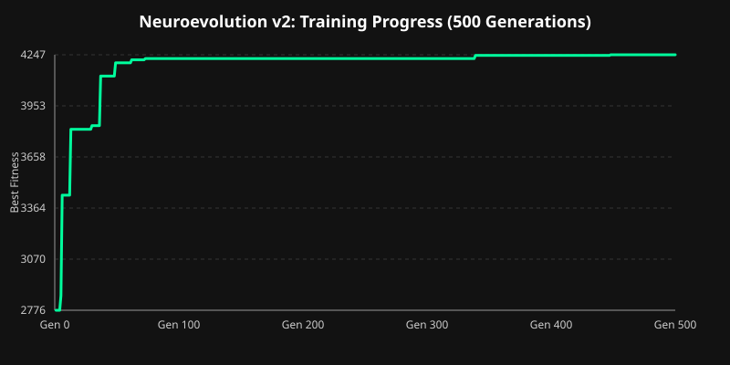

# Project-RLM: Super Mario Bros Neuroevolution AI

A custom Neuroevolution and Genetic Algorithm AI built from scratch using pure NumPy to play **Super Mario Bros (NES)**.

## Overview

This project evolves a population of neural networks to navigate levels in *Super Mario Bros (World 1-1)* without relying on heavy deep learning frameworks like PyTorch or TensorFlow. The training is heavily accelerated using **CuPy (GPU)** and **16-core parallel multiprocessing**.



### Key Architecture Components:
- **Environment Loop (Phase 1):** NES emulator interface powered by `gym-super-mario-bros` and `nes-py`, mapped to a simplified 7-action discrete joypad space (`SIMPLE_MOVEMENT`).
- **Vision Grid System (Phase 2):** Real-time RAM extraction parsing tilemaps, ground, obstacles, pipes (`1`), enemies (`-1`), empty space (`0`), and Mario's centered position (`2`) into a 16×16 spatial grid (flattened to 256 inputs).
- **Dual-Window Visualizer:** OpenCV-powered real-time game renderer showing live gameplay alongside a color-coded representation of the neural network's visual sensory input.
- **CuPy-Accelerated Neural Network (v2 Architecture):** 
  - Input Layer: 258 inputs (16×16 vision grid + `dx`, `dy` velocities)
  - Hidden Layer: 64 neurons with ReLU activation (Xavier initialization)
  - Output Layer: 7 neurons corresponding to controller actions
- **Genetic Algorithm & Evolution:**
  - Population size: 100 neural networks (processed in parallel batches of 16)
  - Fitness function: Maximum horizontal distance ($x$-position) + Speed Bonus
  - Early timeout mechanism: Breaks evaluation if progress stalls for 75 frames (with 4x FrameSkip)
  - Selection & Elitism: Tournament Selection (k=3), Top 10% elite networks preserved
  - Crossover & Mutation: Additive Gaussian Noise mutation (σ=0.3)

---

## Getting Started

### Prerequisites
- Python 3.10 - 3.12+ (Virtual environment recommended)

### Installation
```bash
# Clone the repository
git clone https://github.com/Agilan-w/Project-RLM.git
cd Project-RLM

# Install dependencies
pip install -r requirements.txt
```

### Training the AI
```bash
python main.py
```

### Watching the Champion Replay
Once you have trained the AI (or loaded a `mario_checkpoint.npz`), you can run a high-fidelity rendering script that records the gameplay and displays a futuristic HUD with the AI's internal vision and decision-making state.

```bash
python playback.py
```
This will save a `champion_run.mp4` video automatically.

---

## 📁 Project Structure

```
.
├── main.py              # Main training loop, NeuralNet, GeneticAlgorithm, and Vision Grid
├── test_ram.py          # RAM extraction debugging script
├── requirements.txt     # Python dependencies
├── .gitignore
├── LICENSE
└── README.md
```

## 📜 License
This project is licensed under the MIT License - see the [LICENSE](LICENSE) file for details.
